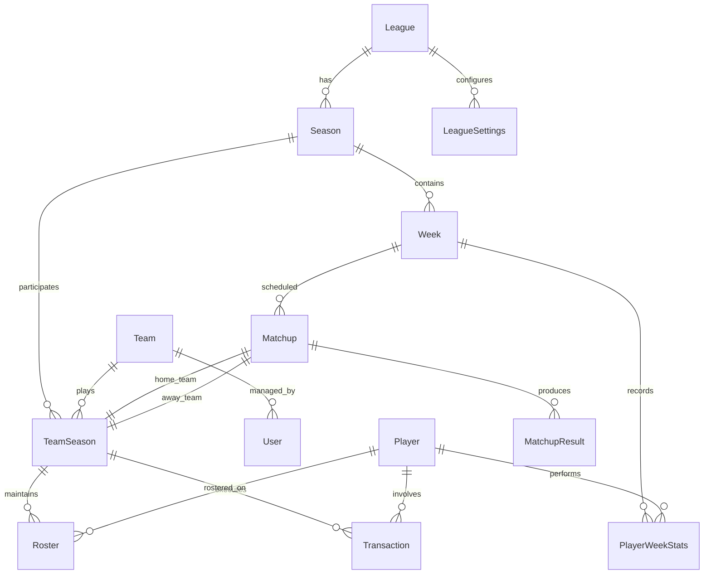

# Technical Specifications: RFFL_codex_DB
## Historical Fantasy Football Database System

**Document Version:** 1.0  
**Date:** August 28, 2025  
**Project Phase:** Phase 1 - Technical Architecture  
**Document Owner:** Technical Architecture Team  

---

## 1. System Architecture Overview

### 1.1 High-Level Architecture
```
┌─────────────────┐    ┌─────────────────┐    ┌─────────────────┐
│   Frontend      │    │   Backend API   │    │   Database      │
│   (Next.js)     │◄──►│   (NestJS)      │◄──►│  (PostgreSQL)   │
│                 │    │                 │    │                 │
│ • Admin UI      │    │ • REST API      │    │ • Fantasy Data  │
│ • Dashboard     │    │ • Data Ingestion│    │ • User Data     │
│ • Monitoring    │    │ • Validation    │    │ • Audit Logs    │
└─────────────────┘    └─────────────────┘    └─────────────────┘
                                │
                                ▼
                       ┌─────────────────┐
                       │  External APIs  │
                       │                 │
                       │ • ESPN Fantasy  │
                       │ • Data Sources  │
                       │ • Monitoring    │
                       └─────────────────┘
```

### 1.2 Technology Stack

#### 1.2.1 Core Technologies
| Component | Technology | Version | Rationale |
|-----------|------------|---------|-----------|
| Frontend Framework | Next.js | 14+ | Server-side rendering, App Router, excellent DX |
| Backend Framework | NestJS | 10+ | TypeScript-first, modular architecture, excellent for APIs |
| Database | PostgreSQL | 15+ | ACID compliance, JSON support, excellent performance |
| ORM | Prisma | 5+ | Type safety, migrations, excellent DX |
| Language | TypeScript | 5+ | Type safety, better maintainability |
| Package Manager | pnpm | 8+ | Fast, efficient, monorepo support |
| Build System | Turbo | 1+ | Monorepo build optimization |

#### 1.2.2 Supporting Technologies
| Component | Technology | Purpose |
|-----------|------------|---------|
| Authentication | NextAuth.js | Secure authentication with multiple providers |
| Validation | Zod | Runtime type validation for APIs |
| Testing | Jest + Vitest | Unit and integration testing |
| E2E Testing | Playwright | End-to-end testing |
| Monitoring | Sentry | Error tracking and performance monitoring |
| Caching | Redis | Session storage and query caching |
| Queue System | Bull/BullMQ | Background job processing |
| Documentation | OpenAPI/Swagger | API documentation generation |

---

## 2. Database Schema Design

### 2.1 Core Entity Relationships



### 2.2 Detailed Schema Specifications

#### 2.2.1 League Management Tables

```sql
-- Core league information
CREATE TABLE leagues (
    id UUID PRIMARY KEY DEFAULT gen_random_uuid(),
    espn_league_id INTEGER UNIQUE NOT NULL,
    name VARCHAR(255) NOT NULL,
    created_year INTEGER NOT NULL,
    league_type VARCHAR(50) NOT NULL DEFAULT 'standard', -- standard, keeper, dynasty
    visibility VARCHAR(20) NOT NULL DEFAULT 'private', -- public, private
    status VARCHAR(20) NOT NULL DEFAULT 'active', -- active, archived, deleted
    created_at TIMESTAMP WITH TIME ZONE DEFAULT NOW(),
    updated_at TIMESTAMP WITH TIME ZONE DEFAULT NOW(),
    
    CONSTRAINT leagues_created_year_check CHECK (created_year >= 1990 AND created_year <= EXTRACT(YEAR FROM NOW())),
    CONSTRAINT leagues_league_type_check CHECK (league_type IN ('standard', 'keeper', 'dynasty', 'redraft')),
    CONSTRAINT leagues_visibility_check CHECK (visibility IN ('public', 'private')),
    CONSTRAINT leagues_status_check CHECK (status IN ('active', 'archived', 'deleted'))
);

-- Season-specific league configurations
CREATE TABLE league_settings (
    id UUID PRIMARY KEY DEFAULT gen_random_uuid(),
    league_id UUID NOT NULL REFERENCES leagues(id) ON DELETE CASCADE,
    season_year INTEGER NOT NULL,
    team_count INTEGER NOT NULL DEFAULT 10,
    playoff_teams INTEGER NOT NULL DEFAULT 6,
    regular_season_weeks INTEGER NOT NULL DEFAULT 14,
    playoff_weeks INTEGER NOT NULL DEFAULT 3,
    
    -- Scoring settings
    scoring_type VARCHAR(20) NOT NULL DEFAULT 'standard', -- standard, ppr, half_ppr, custom
    qb_scoring JSONB NOT NULL DEFAULT '{}',
    rb_scoring JSONB NOT NULL DEFAULT '{}',
    wr_scoring JSONB NOT NULL DEFAULT '{}',
    te_scoring JSONB NOT NULL DEFAULT '{}',
    k_scoring JSONB NOT NULL DEFAULT '{}',
    def_scoring JSONB NOT NULL DEFAULT '{}',
    
    -- Roster settings
    roster_positions JSONB NOT NULL DEFAULT '{}', -- {"QB": 1, "RB": 2, "WR": 2, ...}
    bench_spots INTEGER NOT NULL DEFAULT 6,
    ir_spots INTEGER NOT NULL DEFAULT 0,
    
    -- Waiver and trade settings
    waiver_type VARCHAR(20) NOT NULL DEFAULT 'rolling',
    waiver_period_days INTEGER NOT NULL DEFAULT 2,
    trade_deadline_week INTEGER,
    
    created_at TIMESTAMP WITH TIME ZONE DEFAULT NOW(),
    updated_at TIMESTAMP WITH TIME ZONE DEFAULT NOW(),
    
    UNIQUE(league_id, season_year),
    CONSTRAINT league_settings_season_year_check CHECK (season_year >= 1990 AND season_year <= EXTRACT(YEAR FROM NOW()) + 1),
    CONSTRAINT league_settings_team_count_check CHECK (team_count >= 2 AND team_count <= 20),
    CONSTRAINT league_settings_scoring_type_check CHECK (scoring_type IN ('standard', 'ppr', 'half_ppr', 'custom'))
);
```

#### 2.2.2 Team and User Management

```sql
-- Team information
CREATE TABLE teams (
    id UUID PRIMARY KEY DEFAULT gen_random_uuid(),
    espn_team_id INTEGER NOT NULL,
    league_id UUID NOT NULL REFERENCES leagues(id) ON DELETE CASCADE,
    name VARCHAR(255) NOT NULL,
    abbreviation VARCHAR(10),
    logo_url TEXT,
    owner_name VARCHAR(255),
    co_owner_names TEXT[], -- Array of co-owner names
    created_at TIMESTAMP WITH TIME ZONE DEFAULT NOW(),
    updated_at TIMESTAMP WITH TIME ZONE DEFAULT NOW(),
    
    UNIQUE(league_id, espn_team_id),
    CONSTRAINT teams_abbreviation_check CHECK (LENGTH(abbreviation) <= 10)
);

-- Season-specific team participation
CREATE TABLE team_seasons (
    id UUID PRIMARY KEY DEFAULT gen_random_uuid(),
    team_id UUID NOT NULL REFERENCES teams(id) ON DELETE CASCADE,
    league_id UUID NOT NULL REFERENCES leagues(id) ON DELETE CASCADE,
    season_year INTEGER NOT NULL,
    final_standing INTEGER,
    regular_season_wins INTEGER DEFAULT 0,
    regular_season_losses INTEGER DEFAULT 0,
    regular_season_ties INTEGER DEFAULT 0,
    points_for DECIMAL(10,2) DEFAULT 0.00,
    points_against DECIMAL(10,2) DEFAULT 0.00,
    playoff_result VARCHAR(50), -- champion, runner_up, consolation_champion, etc.
    acquisition_budget INTEGER DEFAULT 0, -- FAAB budget
    created_at TIMESTAMP WITH TIME ZONE DEFAULT NOW(),
    updated_at TIMESTAMP WITH TIME ZONE DEFAULT NOW(),
    
    UNIQUE(team_id, season_year),
    CONSTRAINT team_seasons_standing_check CHECK (final_standing > 0),
    CONSTRAINT team_seasons_wins_check CHECK (regular_season_wins >= 0),
    CONSTRAINT team_seasons_losses_check CHECK (regular_season_losses >= 0),
    CONSTRAINT team_seasons_ties_check CHECK (regular_season_ties >= 0)
);
```

#### 2.2.3 Player and Statistics Management

```sql
-- Player master data
CREATE TABLE players (
    id UUID PRIMARY KEY DEFAULT gen_random_uuid(),
    espn_player_id INTEGER UNIQUE NOT NULL,
    name VARCHAR(255) NOT NULL,
    position VARCHAR(10) NOT NULL,
    team VARCHAR(10), -- NFL team abbreviation
    jersey_number INTEGER,
    
    -- Player metadata
    status VARCHAR(20) DEFAULT 'active', -- active, injured, suspended, retired
    injury_status VARCHAR(50),
    bye_week INTEGER,
    
    -- Physical attributes (optional)
    height_inches INTEGER,
    weight_lbs INTEGER,
    age INTEGER,
    experience_years INTEGER,
    
    created_at TIMESTAMP WITH TIME ZONE DEFAULT NOW(),
    updated_at TIMESTAMP WITH TIME ZONE DEFAULT NOW(),
    
    CONSTRAINT players_position_check CHECK (position IN ('QB', 'RB', 'WR', 'TE', 'K', 'D/ST', 'DL', 'LB', 'DB')),
    CONSTRAINT players_jersey_number_check CHECK (jersey_number >= 0 AND jersey_number <= 99),
    CONSTRAINT players_bye_week_check CHECK (bye_week >= 1 AND bye_week <= 18)
);

-- Weekly player statistics
CREATE TABLE player_week_stats (
    id UUID PRIMARY KEY DEFAULT gen_random_uuid(),
    player_id UUID NOT NULL REFERENCES players(id) ON DELETE CASCADE,
    season_year INTEGER NOT NULL,
    week_number INTEGER NOT NULL,
    
    -- Game information
    opponent VARCHAR(10),
    game_date DATE,
    is_home BOOLEAN,
    game_result VARCHAR(10), -- W, L, T
    
    -- Fantasy performance
    fantasy_points DECIMAL(8,2) NOT NULL DEFAULT 0.00,
    projected_points DECIMAL(8,2),
    
    -- Detailed statistics (stored as JSONB for flexibility)
    passing_stats JSONB DEFAULT '{}', -- attempts, completions, yards, tds, ints, etc.
    rushing_stats JSONB DEFAULT '{}', -- attempts, yards, tds, fumbles, etc.
    receiving_stats JSONB DEFAULT '{}', -- targets, receptions, yards, tds, etc.
    kicking_stats JSONB DEFAULT '{}', -- fg_made, fg_att, xp_made, xp_att, etc.
    defense_stats JSONB DEFAULT '{}', -- sacks, ints, fumble_rec, tds, etc.
    
    -- Data quality indicators
    is_projected BOOLEAN DEFAULT false,
    data_source VARCHAR(50) NOT NULL DEFAULT 'espn',
    last_updated TIMESTAMP WITH TIME ZONE DEFAULT NOW(),
    
    created_at TIMESTAMP WITH TIME ZONE DEFAULT NOW(),
    
    UNIQUE(player_id, season_year, week_number),
    CONSTRAINT player_week_stats_season_check CHECK (season_year >= 1990 AND season_year <= EXTRACT(YEAR FROM NOW()) + 1),
    CONSTRAINT player_week_stats_week_check CHECK (week_number >= 1 AND week_number <= 18),
    CONSTRAINT player_week_stats_points_check CHECK (fantasy_points >= -10 AND fantasy_points <= 100)
);
```

#### 2.2.4 Matchup and Competition Management

```sql
-- Season structure
CREATE TABLE seasons (
    id UUID PRIMARY KEY DEFAULT gen_random_uuid(),
    league_id UUID NOT NULL REFERENCES leagues(id) ON DELETE CASCADE,
    year INTEGER NOT NULL,
    start_date DATE NOT NULL,
    end_date DATE NOT NULL,
    is_complete BOOLEAN DEFAULT false,
    created_at TIMESTAMP WITH TIME ZONE DEFAULT NOW(),
    updated_at TIMESTAMP WITH TIME ZONE DEFAULT NOW(),
    
    UNIQUE(league_id, year),
    CONSTRAINT seasons_year_check CHECK (year >= 1990 AND year <= EXTRACT(YEAR FROM NOW()) + 1),
    CONSTRAINT seasons_date_check CHECK (end_date > start_date)
);

-- Weekly structure
CREATE TABLE weeks (
    id UUID PRIMARY KEY DEFAULT gen_random_uuid(),
    season_id UUID NOT NULL REFERENCES seasons(id) ON DELETE CASCADE,
    week_number INTEGER NOT NULL,
    week_type VARCHAR(20) NOT NULL DEFAULT 'regular', -- regular, playoff, championship
    start_date DATE NOT NULL,
    end_date DATE NOT NULL,
    is_complete BOOLEAN DEFAULT false,
    
    created_at TIMESTAMP WITH TIME ZONE DEFAULT NOW(),
    updated_at TIMESTAMP WITH TIME ZONE DEFAULT NOW(),
    
    UNIQUE(season_id, week_number),
    CONSTRAINT weeks_number_check CHECK (week_number >= 1 AND week_number <= 18),
    CONSTRAINT weeks_type_check CHECK (week_type IN ('regular', 'playoff', 'championship', 'consolation')),
    CONSTRAINT weeks_date_check CHECK (end_date > start_date)
);

-- Head-to-head matchups
CREATE TABLE matchups (
    id UUID PRIMARY KEY DEFAULT gen_random_uuid(),
    week_id UUID NOT NULL REFERENCES weeks(id) ON DELETE CASCADE,
    home_team_id UUID NOT NULL REFERENCES team_seasons(id),
    away_team_id UUID NOT NULL REFERENCES team_seasons(id),
    
    -- Scoring
    home_score DECIMAL(8,2) DEFAULT 0.00,
    away_score DECIMAL(8,2) DEFAULT 0.00,
    
    -- Matchup metadata
    matchup_type VARCHAR(20) NOT NULL DEFAULT 'regular', -- regular, playoff, consolation
    is_complete BOOLEAN DEFAULT false,
    winner_team_id UUID REFERENCES team_seasons(id),
    
    created_at TIMESTAMP WITH TIME ZONE DEFAULT NOW(),
    updated_at TIMESTAMP WITH TIME ZONE DEFAULT NOW(),
    
    CONSTRAINT matchups_different_teams CHECK (home_team_id != away_team_id),
    CONSTRAINT matchups_winner_valid CHECK (winner_team_id IN (home_team_id, away_team_id) OR winner_team_id IS NULL),
    CONSTRAINT matchups_type_check CHECK (matchup_type IN ('regular', 'playoff', 'consolation', 'championship'))
);
```

#### 2.2.5 Roster and Transaction Management

```sql
-- Active rosters for each week
CREATE TABLE rosters (
    id UUID PRIMARY KEY DEFAULT gen_random_uuid(),
    team_season_id UUID NOT NULL REFERENCES team_seasons(id) ON DELETE CASCADE,
    player_id UUID NOT NULL REFERENCES players(id),
    week_id UUID NOT NULL REFERENCES weeks(id) ON DELETE CASCADE,
    
    -- Roster details
    roster_slot VARCHAR(20) NOT NULL, -- QB, RB, WR, TE, FLEX, K, D/ST, BENCH, IR
    is_starter BOOLEAN NOT NULL DEFAULT false,
    is_captain BOOLEAN DEFAULT false, -- For leagues with captain scoring
    
    -- Performance tracking
    points_scored DECIMAL(8,2) DEFAULT 0.00,
    projected_points DECIMAL(8,2) DEFAULT 0.00,
    
    created_at TIMESTAMP WITH TIME ZONE DEFAULT NOW(),
    
    UNIQUE(team_season_id, player_id, week_id),
    CONSTRAINT rosters_slot_check CHECK (roster_slot IN ('QB', 'RB', 'WR', 'TE', 'FLEX', 'K', 'D/ST', 'BENCH', 'IR', 'SUPER_FLEX'))
);

-- Player transactions (trades, waiver claims, free agent pickups)
CREATE TABLE transactions (
    id UUID PRIMARY KEY DEFAULT gen_random_uuid(),
    league_id UUID NOT NULL REFERENCES leagues(id) ON DELETE CASCADE,
    season_year INTEGER NOT NULL,
    week_number INTEGER,
    
    -- Transaction details
    transaction_type VARCHAR(20) NOT NULL, -- trade, waiver, free_agent, drop
    transaction_date TIMESTAMP WITH TIME ZONE NOT NULL,
    espn_transaction_id BIGINT,
    
    -- Teams involved
    proposing_team_id UUID REFERENCES team_seasons(id),
    accepting_team_id UUID REFERENCES team_seasons(id),
    
    -- Transaction metadata
    status VARCHAR(20) DEFAULT 'completed', -- pending, completed, vetoed, cancelled
    waiver_priority INTEGER,
    bid_amount INTEGER, -- FAAB bid amount
    
    -- Additional details
    notes TEXT,
    
    created_at TIMESTAMP WITH TIME ZONE DEFAULT NOW(),
    updated_at TIMESTAMP WITH TIME ZONE DEFAULT NOW(),
    
    CONSTRAINT transactions_type_check CHECK (transaction_type IN ('trade', 'waiver', 'free_agent', 'drop', 'add')),
    CONSTRAINT transactions_status_check CHECK (status IN ('pending', 'completed', 'vetoed', 'cancelled'))
);

-- Individual player movements within transactions
CREATE TABLE transaction_players (
    id UUID PRIMARY KEY DEFAULT gen_random_uuid(),
    transaction_id UUID NOT NULL REFERENCES transactions(id) ON DELETE CASCADE,
    player_id UUID NOT NULL REFERENCES players(id),
    from_team_id UUID REFERENCES team_seasons(id),
    to_team_id UUID REFERENCES team_seasons(id),
    movement_type VARCHAR(20) NOT NULL, -- acquired, dropped, traded_away, traded_for
    
    created_at TIMESTAMP WITH TIME ZONE DEFAULT NOW(),
    
    CONSTRAINT transaction_players_movement_check CHECK (movement_type IN ('acquired', 'dropped', 'traded_away', 'traded_for'))
);
```

### 2.3 Indexing Strategy

```sql
-- Performance-critical indexes for query optimization

-- League and season lookup optimization
CREATE INDEX idx_leagues_espn_id ON leagues(espn_league_id);
CREATE INDEX idx_leagues_status ON leagues(status) WHERE status = 'active';
CREATE INDEX idx_seasons_league_year ON seasons(league_id, year);
CREATE INDEX idx_weeks_season_number ON weeks(season_id, week_number);

-- Player statistics optimization
CREATE INDEX idx_player_stats_player_season ON player_week_stats(player_id, season_year);
CREATE INDEX idx_player_stats_week ON player_week_stats(season_year, week_number);
CREATE INDEX idx_player_stats_points ON player_week_stats(fantasy_points DESC) WHERE fantasy_points > 0;

-- Team performance optimization
CREATE INDEX idx_team_seasons_league_year ON team_seasons(league_id, season_year);
CREATE INDEX idx_team_seasons_standings ON team_seasons(season_year, final_standing) WHERE final_standing IS NOT NULL;

-- Roster and matchup optimization
CREATE INDEX idx_rosters_team_week ON rosters(team_season_id, week_id);
CREATE INDEX idx_rosters_starters ON rosters(week_id, is_starter) WHERE is_starter = true;
CREATE INDEX idx_matchups_week ON matchups(week_id);
CREATE INDEX idx_matchups_teams ON matchups(home_team_id, away_team_id);

-- Transaction tracking optimization
CREATE INDEX idx_transactions_league_season ON transactions(league_id, season_year);
CREATE INDEX idx_transactions_date ON transactions(transaction_date DESC);
CREATE INDEX idx_transactions_type ON transactions(transaction_type);

-- Audit and monitoring indexes
CREATE INDEX idx_leagues_updated ON leagues(updated_at DESC);
CREATE INDEX idx_player_stats_updated ON player_week_stats(last_updated DESC);
```

---

## 3. API Integration Specifications

### 3.1 ESPN Fantasy Football API Integration

#### 3.1.1 Authentication and Access
```typescript
// ESPN API Configuration
interface ESPNConfig {
  baseUrl: string; // 'https://fantasy.espn.com/apis/v3/games/ffl'
  rateLimit: {
    requestsPerSecond: number; // 10 requests per second max
    burstLimit: number; // 50 requests burst capacity
    cooldownPeriod: number; // 60 seconds cooldown after burst
  };
  authentication: {
    type: 'session' | 'swid'; // ESPN session-based auth
    sessionCookie?: string;
    swidCookie?: string;
  };
  retryPolicy: {
    maxRetries: number; // 3 retry attempts
    backoffMultiplier: number; // Exponential backoff: 2x
    initialDelay: number; // 1000ms initial delay
  };
}
```

#### 3.1.2 Core API Endpoints

```typescript
// League Information Endpoints
interface ESPNLeagueEndpoints {
  // Basic league information
  getLeague: (leagueId: number, seasonId: number) => Promise<ESPNLeague>;
  
  // Season settings and scoring configuration
  getSettings: (leagueId: number, seasonId: number) => Promise<ESPNSettings>;
  
  // Team roster and lineup information
  getTeams: (leagueId: number, seasonId: number, scoringPeriodId?: number) => Promise<ESPNTeam[]>;
  
  // Player statistics and projections
  getPlayers: (leagueId: number, seasonId: number, filters?: ESPNPlayerFilters) => Promise<ESPNPlayer[]>;
  
  // Matchup results and scheduling
  getMatchups: (leagueId: number, seasonId: number, scoringPeriodId?: number) => Promise<ESPNMatchup[]>;
  
  // Transaction history
  getTransactions: (leagueId: number, seasonId: number) => Promise<ESPNTransaction[]>;
  
  // Draft information
  getDraft: (leagueId: number, seasonId: number) => Promise<ESPNDraft>;
}

// API Response Type Definitions
interface ESPNLeague {
  id: number;
  settings: {
    name: string;
    size: number;
    scoringSettings: ScoringSettings;
    rosterSettings: RosterSettings;
    scheduleSettings: ScheduleSettings;
  };
  status: {
    currentMatchupPeriod: number;
    finalScoringPeriod: number;
    firstScoringPeriod: number;
    isActive: boolean;
    latestScoringPeriod: number;
  };
  teams: ESPNTeam[];
  members: ESPNMember[];
}

interface ESPNTeam {
  id: number;
  abbrev: string;
  name: string;
  logo: string;
  owners: string[];
  roster: {
    entries: RosterEntry[];
  };
  record: {
    overall: {
      wins: number;
      losses: number;
      ties: number;
      pointsFor: number;
      pointsAgainst: number;
    };
  };
}

interface ESPNPlayer {
  id: number;
  fullName: string;
  eligibleSlots: number[];
  defaultPositionId: number;
  stats: PlayerStats[];
  ownership: {
    percentOwned: number;
    percentChange: number;
    percentStarted: number;
  };
}
```

#### 3.1.3 Data Ingestion Pipeline

```typescript
// Data ingestion service architecture
@Injectable()
export class ESPNIngestionService {
  constructor(
    private readonly espnApiClient: ESPNApiClient,
    private readonly dataValidationService: DataValidationService,
    private readonly prismaService: PrismaService,
    private readonly queueService: QueueService
  ) {}

  // Main ingestion orchestration
  async ingestLeagueHistory(
    leagueId: number,
    startYear: number,
    endYear: number,
    options: IngestionOptions = {}
  ): Promise<IngestionResult> {
    const ingestionJob = await this.createIngestionJob({
      leagueId,
      startYear,
      endYear,
      options
    });

    // Queue parallel ingestion jobs for each season
    const seasonJobs = [];
    for (let year = startYear; year <= endYear; year++) {
      seasonJobs.push(
        this.queueService.add('ingest-season', {
          jobId: ingestionJob.id,
          leagueId,
          seasonYear: year,
          options
        })
      );
    }

    return this.trackIngestionProgress(ingestionJob.id, seasonJobs);
  }

  // Season-specific data ingestion
  async ingestSeasonData(
    leagueId: number,
    seasonYear: number,
    options: IngestionOptions
  ): Promise<SeasonIngestionResult> {
    try {
      // 1. League and settings ingestion
      const leagueData = await this.espnApiClient.getLeague(leagueId, seasonYear);
      await this.ingestLeagueSettings(leagueData, seasonYear);

      // 2. Team and member ingestion
      const teamsData = await this.espnApiClient.getTeams(leagueId, seasonYear);
      await this.ingestTeams(leagueData.id, teamsData, seasonYear);

      // 3. Player statistics ingestion (weekly)
      await this.ingestPlayerStatistics(leagueId, seasonYear, options);

      // 4. Matchup results ingestion
      await this.ingestMatchups(leagueId, seasonYear);

      // 5. Transaction history ingestion
      await this.ingestTransactions(leagueId, seasonYear);

      // 6. Data validation and quality checks
      const validationResult = await this.validateSeasonData(leagueId, seasonYear);

      return {
        success: true,
        leagueId,
        seasonYear,
        recordsIngested: validationResult.totalRecords,
        validationScore: validationResult.qualityScore,
        errors: validationResult.errors
      };

    } catch (error) {
      return this.handleIngestionError(error, leagueId, seasonYear);
    }
  }

  // Player statistics ingestion with weekly granularity
  private async ingestPlayerStatistics(
    leagueId: number,
    seasonYear: number,
    options: IngestionOptions
  ): Promise<void> {
    const totalWeeks = await this.getTotalWeeks(leagueId, seasonYear);
    
    for (let week = 1; week <= totalWeeks; week++) {
      // Rate limiting to respect ESPN API constraints
      await this.rateLimiter.waitForSlot();
      
      const weeklyData = await this.espnApiClient.getPlayers(
        leagueId,
        seasonYear,
        { scoringPeriodId: week }
      );

      // Batch process player statistics
      await this.batchProcessPlayerStats(weeklyData, seasonYear, week);
      
      // Progress tracking
      await this.updateIngestionProgress(leagueId, seasonYear, week, totalWeeks);
    }
  }
}
```

### 3.2 Internal API Specifications

#### 3.2.1 RESTful API Design

```typescript
// API Controller Structure
@Controller('api/v1')
@ApiTags('Fantasy Football Data API')
export class FantasyDataController {
  
  // League endpoints
  @Get('leagues')
  @ApiOperation({ summary: 'Get all accessible leagues' })
  @ApiResponse({ status: 200, type: [LeagueResponseDto] })
  async getLeagues(@Query() query: LeagueQueryDto): Promise<LeagueResponseDto[]> {
    return this.fantasyDataService.getLeagues(query);
  }

  @Get('leagues/:leagueId')
  @ApiOperation({ summary: 'Get specific league details' })
  @ApiResponse({ status: 200, type: LeagueDetailDto })
  async getLeague(@Param('leagueId') leagueId: string): Promise<LeagueDetailDto> {
    return this.fantasyDataService.getLeagueById(leagueId);
  }

  @Get('leagues/:leagueId/seasons')
  @ApiOperation({ summary: 'Get all seasons for a league' })
  @ApiResponse({ status: 200, type: [SeasonResponseDto] })
  async getLeagueSeasons(
    @Param('leagueId') leagueId: string,
    @Query() query: SeasonQueryDto
  ): Promise<SeasonResponseDto[]> {
    return this.fantasyDataService.getLeagueSeasons(leagueId, query);
  }

  // Player statistics endpoints
  @Get('players')
  @ApiOperation({ summary: 'Search players with statistics' })
  @ApiResponse({ status: 200, type: PaginatedPlayerResponse })
  async getPlayers(@Query() query: PlayerQueryDto): Promise<PaginatedPlayerResponse> {
    return this.fantasyDataService.searchPlayers(query);
  }

  @Get('players/:playerId/stats')
  @ApiOperation({ summary: 'Get detailed player statistics' })
  @ApiResponse({ status: 200, type: PlayerStatsResponseDto })
  async getPlayerStats(
    @Param('playerId') playerId: string,
    @Query() query: StatsQueryDto
  ): Promise<PlayerStatsResponseDto> {
    return this.fantasyDataService.getPlayerStatistics(playerId, query);
  }

  // Team and matchup endpoints
  @Get('leagues/:leagueId/seasons/:seasonYear/matchups')
  @ApiOperation({ summary: 'Get matchups for a specific season' })
  @ApiResponse({ status: 200, type: [MatchupResponseDto] })
  async getMatchups(
    @Param('leagueId') leagueId: string,
    @Param('seasonYear') seasonYear: number,
    @Query() query: MatchupQueryDto
  ): Promise<MatchupResponseDto[]> {
    return this.fantasyDataService.getMatchups(leagueId, seasonYear, query);
  }

  // Analytics endpoints
  @Get('analytics/trends')
  @ApiOperation({ summary: 'Get fantasy football trends and analytics' })
  @ApiResponse({ status: 200, type: AnalyticsResponseDto })
  async getTrends(@Query() query: AnalyticsQueryDto): Promise<AnalyticsResponseDto> {
    return this.analyticsService.getTrends(query);
  }
}
```

#### 3.2.2 Data Transfer Objects (DTOs)

```typescript
// Request DTOs with validation
export class LeagueQueryDto {
  @IsOptional()
  @IsString()
  @ApiPropertyOptional({ description: 'Filter leagues by name' })
  name?: string;

  @IsOptional()
  @IsInt()
  @Min(1990)
  @Max(new Date().getFullYear() + 1)
  @ApiPropertyOptional({ description: 'Filter by creation year' })
  createdYear?: number;

  @IsOptional()
  @IsEnum(LeagueStatus)
  @ApiPropertyOptional({ enum: LeagueStatus })
  status?: LeagueStatus;

  @IsOptional()
  @IsInt()
  @Min(1)
  @Max(100)
  @ApiPropertyOptional({ description: 'Page size (default: 20)' })
  limit?: number = 20;

  @IsOptional()
  @IsInt()
  @Min(0)
  @ApiPropertyOptional({ description: 'Page offset (default: 0)' })
  offset?: number = 0;
}

export class PlayerQueryDto {
  @IsOptional()
  @IsString()
  @MinLength(2)
  @ApiPropertyOptional({ description: 'Player name search' })
  name?: string;

  @IsOptional()
  @IsEnum(Position)
  @ApiPropertyOptional({ enum: Position })
  position?: Position;

  @IsOptional()
  @IsString()
  @Length(2, 4)
  @ApiPropertyOptional({ description: 'NFL team abbreviation' })
  team?: string;

  @IsOptional()
  @IsInt()
  @Min(1990)
  @ApiPropertyOptional({ description: 'Season year' })
  seasonYear?: number;

  @IsOptional()
  @IsInt()
  @Min(1)
  @Max(18)
  @ApiPropertyOptional({ description: 'Week number' })
  weekNumber?: number;

  @IsOptional()
  @IsEnum(SortOrder)
  @ApiPropertyOptional({ enum: SortOrder })
  sortBy?: SortOrder = SortOrder.FANTASY_POINTS_DESC;
}

// Response DTOs
export class LeagueResponseDto {
  @ApiProperty({ description: 'Unique league identifier' })
  id: string;

  @ApiProperty({ description: 'ESPN league ID' })
  espnLeagueId: number;

  @ApiProperty({ description: 'League name' })
  name: string;

  @ApiProperty({ description: 'Year league was created' })
  createdYear: number;

  @ApiProperty({ description: 'League type', enum: LeagueType })
  leagueType: LeagueType;

  @ApiProperty({ description: 'Current league status', enum: LeagueStatus })
  status: LeagueStatus;

  @ApiProperty({ description: 'Number of seasons available' })
  seasonsCount: number;

  @ApiProperty({ description: 'Latest available season year' })
  latestSeasonYear: number;

  @ApiProperty({ description: 'Data quality score (0-100)' })
  dataQualityScore: number;

  @ApiProperty({ description: 'Last data update timestamp' })
  lastUpdated: Date;
}

export class PlayerStatsResponseDto {
  @ApiProperty({ description: 'Player information' })
  player: PlayerDto;

  @ApiProperty({ description: 'Season and week context' })
  context: StatsContextDto;

  @ApiProperty({ description: 'Fantasy performance metrics' })
  fantasyStats: FantasyStatsDto;

  @ApiProperty({ description: 'Detailed NFL statistics' })
  nflStats: NFLStatsDto;

  @ApiProperty({ description: 'Contextual performance data' })
  performance: PerformanceMetricsDto;
}
```

### 3.3 Data Validation and Quality Assurance

#### 3.3.1 Validation Pipeline Architecture

```typescript
@Injectable()
export class DataValidationService {
  
  // Multi-level validation pipeline
  async validateIngestedData(
    dataType: DataType,
    payload: any,
    context: ValidationContext
  ): Promise<ValidationResult> {
    const validators = [
      this.schemaValidation,
      this.businessRuleValidation,
      this.historicalConsistencyValidation,
      this.crossReferenceValidation
    ];

    const results: ValidationResult[] = [];
    
    for (const validator of validators) {
      const result = await validator(dataType, payload, context);
      results.push(result);
      
      if (result.severity === 'critical' && !result.passed) {
        break; // Stop validation on critical failures
      }
    }

    return this.aggregateValidationResults(results);
  }

  // Schema-level validation
  private async schemaValidation(
    dataType: DataType,
    payload: any,
    context: ValidationContext
  ): Promise<ValidationResult> {
    try {
      const schema = this.getValidationSchema(dataType);
      await schema.parseAsync(payload);
      
      return {
        passed: true,
        severity: 'info',
        validationType: 'schema',
        message: 'Schema validation passed'
      };
    } catch (error) {
      return {
        passed: false,
        severity: 'critical',
        validationType: 'schema',
        message: `Schema validation failed: ${error.message}`,
        errors: error.errors
      };
    }
  }

  // Business rule validation
  private async businessRuleValidation(
    dataType: DataType,
    payload: any,
    context: ValidationContext
  ): Promise<ValidationResult> {
    const rules = this.getBusinessRules(dataType);
    const violations: BusinessRuleViolation[] = [];

    for (const rule of rules) {
      const result = await rule.validate(payload, context);
      if (!result.passed) {
        violations.push({
          ruleName: rule.name,
          description: rule.description,
          severity: result.severity,
          violatedValue: result.violatedValue,
          expectedRange: result.expectedRange
        });
      }
    }

    return {
      passed: violations.length === 0,
      severity: violations.some(v => v.severity === 'critical') ? 'critical' : 'warning',
      validationType: 'business_rules',
      message: violations.length === 0 ? 'Business rule validation passed' : 'Business rule violations found',
      violations
    };
  }

  // Statistical outlier detection
  private async detectOutliers(
    playerStats: PlayerWeekStats[],
    context: ValidationContext
  ): Promise<OutlierDetectionResult> {
    const historicalStats = await this.getHistoricalStats(
      context.playerId,
      context.position,
      context.seasonYear
    );

    const outliers: StatisticalOutlier[] = [];

    // Z-score analysis for fantasy points
    const fantasyPointsZScore = this.calculateZScore(
      playerStats.fantasyPoints,
      historicalStats.fantasyPoints
    );

    if (Math.abs(fantasyPointsZScore) > 3.0) {
      outliers.push({
        metric: 'fantasy_points',
        value: playerStats.fantasyPoints,
        zScore: fantasyPointsZScore,
        historicalMean: historicalStats.fantasyPoints.mean,
        historicalStdDev: historicalStats.fantasyPoints.stdDev,
        severity: Math.abs(fantasyPointsZScore) > 4.0 ? 'critical' : 'warning'
      });
    }

    return {
      outliersDetected: outliers.length > 0,
      outliers,
      confidence: this.calculateConfidenceScore(historicalStats.sampleSize),
      recommendedAction: this.getOutlierAction(outliers)
    };
  }
}

// Validation schemas using Zod
const PlayerWeekStatsSchema = z.object({
  playerId: z.string().uuid(),
  seasonYear: z.number().int().min(1990).max(new Date().getFullYear() + 1),
  weekNumber: z.number().int().min(1).max(18),
  fantasyPoints: z.number().min(-10).max(100),
  projectedPoints: z.number().optional(),
  passingStats: z.object({
    attempts: z.number().int().min(0).max(100).optional(),
    completions: z.number().int().min(0).max(100).optional(),
    yards: z.number().int().min(-50).max(600).optional(),
    touchdowns: z.number().int().min(0).max(10).optional(),
    interceptions: z.number().int().min(0).max(10).optional()
  }).optional(),
  rushingStats: z.object({
    attempts: z.number().int().min(0).max(50).optional(),
    yards: z.number().int().min(-50).max(400).optional(),
    touchdowns: z.number().int().min(0).max(6).optional(),
    fumbles: z.number().int().min(0).max(5).optional()
  }).optional(),
  receivingStats: z.object({
    targets: z.number().int().min(0).max(30).optional(),
    receptions: z.number().int().min(0).max(25).optional(),
    yards: z.number().int().min(0).max(400).optional(),
    touchdowns: z.number().int().min(0).max(6).optional()
  }).optional()
}).refine((data) => {
  // Custom validation: completions cannot exceed attempts
  if (data.passingStats?.completions && data.passingStats?.attempts) {
    return data.passingStats.completions <= data.passingStats.attempts;
  }
  return true;
}, {
  message: "Passing completions cannot exceed attempts"
});
```

---

## 4. Performance and Scalability Requirements

### 4.1 Database Performance Optimization

#### 4.1.1 Query Optimization Strategies

```sql
-- Materialized views for common analytical queries
CREATE MATERIALIZED VIEW player_season_summary AS
SELECT 
    p.id as player_id,
    p.name,
    p.position,
    pws.season_year,
    COUNT(*) as games_played,
    SUM(pws.fantasy_points) as total_fantasy_points,
    AVG(pws.fantasy_points) as avg_fantasy_points,
    STDDEV(pws.fantasy_points) as fantasy_points_stddev,
    MIN(pws.fantasy_points) as min_fantasy_points,
    MAX(pws.fantasy_points) as max_fantasy_points,
    PERCENTILE_CONT(0.5) WITHIN GROUP (ORDER BY pws.fantasy_points) as median_fantasy_points
FROM players p
JOIN player_week_stats pws ON p.id = pws.player_id
WHERE pws.fantasy_points > 0
GROUP BY p.id, p.name, p.position, pws.season_year;

-- Create index on materialized view
CREATE INDEX idx_player_season_summary_position_year ON player_season_summary(position, season_year);
CREATE INDEX idx_player_season_summary_points ON player_season_summary(total_fantasy_points DESC);

-- League standings materialized view
CREATE MATERIALIZED VIEW league_standings AS
SELECT 
    ts.league_id,
    ts.season_year,
    ts.team_id,
    t.name as team_name,
    ts.regular_season_wins,
    ts.regular_season_losses,
    ts.regular_season_ties,
    ts.points_for,
    ts.points_against,
    (ts.points_for - ts.points_against) as point_differential,
    ts.final_standing,
    RANK() OVER (PARTITION BY ts.league_id, ts.season_year ORDER BY ts.regular_season_wins DESC, ts.points_for DESC) as calculated_standing
FROM team_seasons ts
JOIN teams t ON ts.team_id = t.id
WHERE ts.season_year IS NOT NULL;

-- Performance monitoring queries
CREATE OR REPLACE FUNCTION analyze_query_performance() 
RETURNS TABLE(
    query_type VARCHAR,
    avg_execution_time_ms NUMERIC,
    call_count BIGINT,
    total_time_ms NUMERIC
) AS $$
BEGIN
    RETURN QUERY
    SELECT 
        'player_stats_lookup'::VARCHAR as query_type,
        AVG(total_exec_time)::NUMERIC as avg_execution_time_ms,
        calls::BIGINT as call_count,
        total_exec_time::NUMERIC as total_time_ms
    FROM pg_stat_statements 
    WHERE query LIKE '%player_week_stats%'
    AND query LIKE '%WHERE%'
    UNION ALL
    SELECT 
        'league_lookup'::VARCHAR as query_type,
        AVG(total_exec_time)::NUMERIC as avg_execution_time_ms,
        calls::BIGINT as call_count,
        total_exec_time::NUMERIC as total_time_ms
    FROM pg_stat_statements 
    WHERE query LIKE '%leagues%'
    AND query LIKE '%JOIN%';
END;
$$ LANGUAGE plpgsql;
```

#### 4.1.2 Caching Strategy Implementation

```typescript
// Redis-based caching service
@Injectable()
export class CacheService {
  constructor(
    @Inject('REDIS_CLIENT') private readonly redisClient: Redis,
    private readonly configService: ConfigService
  ) {}

  // Multi-tier caching strategy
  async getWithCache<T>(
    key: string,
    fetchFunction: () => Promise<T>,
    options: CacheOptions = {}
  ): Promise<T> {
    const cacheKey = this.buildCacheKey(key);
    const ttl = options.ttl || this.getDefaultTTL(options.tier || 'standard');

    try {
      // L1: In-memory cache check
      const memoryResult = this.memoryCache.get(cacheKey);
      if (memoryResult !== undefined) {
        return memoryResult;
      }

      // L2: Redis cache check
      const redisResult = await this.redisClient.get(cacheKey);
      if (redisResult) {
        const parsed = JSON.parse(redisResult);
        this.memoryCache.set(cacheKey, parsed, { ttl: Math.min(ttl, 300) }); // 5min max in memory
        return parsed;
      }

      // L3: Database fetch
      const freshData = await fetchFunction();
      
      // Store in both cache tiers
      await Promise.all([
        this.redisClient.setex(cacheKey, ttl, JSON.stringify(freshData)),
        this.memoryCache.set(cacheKey, freshData, { ttl: Math.min(ttl, 300) })
      ]);

      return freshData;
      
    } catch (error) {
      this.logger.error(`Cache operation failed for key ${cacheKey}:`, error);
      return fetchFunction(); // Fallback to direct fetch
    }
  }

  // Intelligent cache invalidation
  async invalidatePattern(pattern: string): Promise<void> {
    const keys = await this.redisClient.keys(pattern);
    if (keys.length > 0) {
      await this.redisClient.del(...keys);
    }
    this.memoryCache.clear(); // Clear memory cache for simplicity
  }

  // Cache warming for frequently accessed data
  async warmCache(league: League): Promise<void> {
    const warmingTasks = [
      // Pre-load current season data
      this.warmLeagueData(league.id, new Date().getFullYear()),
      // Pre-load popular player statistics
      this.warmPopularPlayers(league.id),
      // Pre-load league standings
      this.warmLeagueStandings(league.id)
    ];

    await Promise.all(warmingTasks);
  }

  private getDefaultTTL(tier: CacheTier): number {
    const ttlMap = {
      'static': 86400, // 24 hours - for rarely changing data
      'standard': 3600, // 1 hour - for regular data
      'dynamic': 300, // 5 minutes - for frequently changing data
      'realtime': 60 // 1 minute - for live data
    };
    return ttlMap[tier] || ttlMap.standard;
  }
}

// Query result caching decorator
export function Cacheable(options: CacheableOptions = {}) {
  return function(target: any, propertyName: string, descriptor: PropertyDescriptor) {
    const originalMethod = descriptor.value;
    
    descriptor.value = async function(...args: any[]) {
      const cacheService: CacheService = this.cacheService;
      const cacheKey = options.keyGenerator 
        ? options.keyGenerator(...args)
        : `${target.constructor.name}:${propertyName}:${JSON.stringify(args)}`;
      
      return cacheService.getWithCache(
        cacheKey,
        () => originalMethod.apply(this, args),
        options
      );
    };
    
    return descriptor;
  };
}

// Usage example
@Injectable()
export class FantasyDataService {
  @Cacheable({ ttl: 3600, tier: 'standard' })
  async getPlayerSeasonStats(playerId: string, seasonYear: number): Promise<PlayerSeasonStats> {
    return this.prisma.playerWeekStats.aggregate({
      where: { playerId, seasonYear },
      _sum: { fantasyPoints: true },
      _avg: { fantasyPoints: true },
      _count: true
    });
  }

  @Cacheable({ ttl: 300, tier: 'dynamic' })
  async getLeagueStandings(leagueId: string, seasonYear: number): Promise<TeamStanding[]> {
    return this.prisma.teamSeason.findMany({
      where: { leagueId, seasonYear },
      orderBy: [
        { regularSeasonWins: 'desc' },
        { pointsFor: 'desc' }
      ],
      include: { team: true }
    });
  }
}
```

### 4.2 API Performance Optimization

#### 4.2.1 Response Time Optimization

```typescript
// Request/Response interceptor for performance monitoring
@Injectable()
export class PerformanceInterceptor implements NestInterceptor {
  constructor(private readonly logger: Logger) {}

  intercept(context: ExecutionContext, next: CallHandler): Observable<any> {
    const startTime = Date.now();
    const request = context.switchToHttp().getRequest();
    const endpoint = `${request.method} ${request.route?.path || request.url}`;

    return next.handle().pipe(
      tap(() => {
        const duration = Date.now() - startTime;
        
        // Log slow queries
        if (duration > 1000) {
          this.logger.warn(`Slow API response: ${endpoint} took ${duration}ms`);
        }
        
        // Store metrics for monitoring
        this.recordMetrics(endpoint, duration, 'success');
      }),
      catchError((error) => {
        const duration = Date.now() - startTime;
        this.recordMetrics(endpoint, duration, 'error');
        throw error;
      })
    );
  }

  private recordMetrics(endpoint: string, duration: number, status: 'success' | 'error'): void {
    // Implementation would integrate with monitoring service (Prometheus, DataDog, etc.)
    MetricsCollector.recordApiResponse({
      endpoint,
      duration,
      status,
      timestamp: new Date()
    });
  }
}

// Pagination helper for large datasets
export class PaginationHelper {
  static calculateLimits(page: number, size: number): { skip: number; take: number } {
    const maxSize = 100; // Prevent excessive data requests
    const safeSize = Math.min(size || 20, maxSize);
    const safePage = Math.max(page || 1, 1);
    
    return {
      skip: (safePage - 1) * safeSize,
      take: safeSize
    };
  }

  static buildPaginatedResponse<T>(
    data: T[],
    total: number,
    page: number,
    size: number
  ): PaginatedResponse<T> {
    const totalPages = Math.ceil(total / size);
    
    return {
      data,
      pagination: {
        page,
        size,
        total,
        totalPages,
        hasNext: page < totalPages,
        hasPrevious: page > 1
      }
    };
  }
}

// Database connection pooling optimization
export const DatabaseConfig: TypeOrmModuleOptions = {
  type: 'postgres',
  host: process.env.DB_HOST,
  port: parseInt(process.env.DB_PORT, 10),
  username: process.env.DB_USERNAME,
  password: process.env.DB_PASSWORD,
  database: process.env.DB_DATABASE,
  
  // Connection pooling optimization
  extra: {
    connectionLimit: 20, // Maximum connections in pool
    acquireTimeout: 60000, // 60 seconds to acquire connection
    timeout: 60000, // 60 seconds query timeout
    reconnect: true,
    reconnectTries: 3,
    reconnectInterval: 1000,
    
    // Performance tuning
    max: 20, // Maximum connections
    min: 5, // Minimum connections
    idle: 10000, // Close connection after 10 seconds of inactivity
    acquire: 30000, // Maximum time to acquire connection
    
    // Connection validation
    testOnBorrow: true,
    validationQuery: 'SELECT 1',
    validationInterval: 30000
  },
  
  // Query performance optimization
  logging: process.env.NODE_ENV === 'development' ? ['query', 'error'] : ['error'],
  maxQueryExecutionTime: 5000, // Log queries taking longer than 5 seconds
  
  // Automatic entity loading
  autoLoadEntities: true,
  synchronize: false // Use migrations in production
};
```

### 4.3 Scalability Architecture

#### 4.3.1 Horizontal Scaling Design

```typescript
// Load balancer configuration for API scaling
export interface LoadBalancerConfig {
  strategy: 'round_robin' | 'least_connections' | 'ip_hash';
  healthCheck: {
    endpoint: string;
    interval: number;
    timeout: number;
    retries: number;
  };
  servers: ServerConfig[];
}

// Microservice architecture preparation
@Injectable()
export class DataIngestionService {
  constructor(
    private readonly queueService: QueueService,
    private readonly eventBus: EventBus
  ) {}

  // Distributed data ingestion using message queues
  async distributeIngestionLoad(
    leagues: League[],
    seasonYear: number
  ): Promise<DistributedIngestionResult> {
    const jobBatches = this.createJobBatches(leagues, {
      batchSize: 5, // Process 5 leagues per worker
      priority: 'normal'
    });

    const results = await Promise.allSettled(
      jobBatches.map(batch => this.queueService.addBatch('league-ingestion', batch))
    );

    return this.aggregateIngestionResults(results);
  }

  // Event-driven architecture for real-time updates
  @OnEvent('player.stats.updated')
  async handlePlayerStatsUpdate(event: PlayerStatsUpdateEvent): Promise<void> {
    // Invalidate relevant caches
    await this.cacheService.invalidatePattern(`player:${event.playerId}:*`);
    
    // Notify dependent services
    await this.eventBus.publish('fantasy.stats.changed', {
      playerId: event.playerId,
      seasonYear: event.seasonYear,
      weekNumber: event.weekNumber,
      previousStats: event.previousStats,
      newStats: event.newStats
    });
  }
}

// Database sharding strategy (preparation for future scaling)
export class ShardingStrategy {
  // Shard by league ID for data locality
  static getShardKey(leagueId: string): string {
    const hash = createHash('md5').update(leagueId).digest('hex');
    const shardNumber = parseInt(hash.substring(0, 8), 16) % 4; // 4 shards initially
    return `shard_${shardNumber}`;
  }

  // Time-based partitioning for historical data
  static getPartitionTable(tableName: string, date: Date): string {
    const year = date.getFullYear();
    return `${tableName}_${year}`;
  }
}
```

---

## 5. Security Specifications

### 5.1 Authentication and Authorization

#### 5.1.1 API Security Implementation

```typescript
// JWT-based authentication strategy
@Injectable()
export class JwtStrategy extends PassportStrategy(Strategy) {
  constructor(private readonly userService: UserService) {
    super({
      jwtFromRequest: ExtractJwt.fromAuthHeaderAsBearerToken(),
      ignoreExpiration: false,
      secretOrKey: process.env.JWT_SECRET,
      algorithms: ['HS256']
    });
  }

  async validate(payload: JwtPayload): Promise<User> {
    const user = await this.userService.findById(payload.sub);
    if (!user || !user.isActive) {
      throw new UnauthorizedException();
    }
    
    // Rate limiting per user
    await this.checkUserRateLimit(user.id);
    
    return user;
  }

  private async checkUserRateLimit(userId: string): Promise<void> {
    const key = `rate_limit:user:${userId}`;
    const current = await this.redis.incr(key);
    
    if (current === 1) {
      await this.redis.expire(key, 3600); // 1 hour window
    }
    
    if (current > 1000) { // 1000 requests per hour per user
      throw new HttpException('Rate limit exceeded', 429);
    }
  }
}

// Role-based access control
export enum UserRole {
  ADMIN = 'admin',
  RESEARCHER = 'researcher',
  COMMISSIONER = 'commissioner',
  READ_ONLY = 'read_only'
}

export const RolePermissions = {
  [UserRole.ADMIN]: [
    'leagues:read', 'leagues:write', 'leagues:delete',
    'users:read', 'users:write', 'users:delete',
    'data:ingest', 'data:validate', 'data:export',
    'system:monitor', 'system:configure'
  ],
  [UserRole.RESEARCHER]: [
    'leagues:read', 'players:read', 'stats:read',
    'data:export', 'analytics:read'
  ],
  [UserRole.COMMISSIONER]: [
    'leagues:read', 'leagues:write_own',
    'teams:read', 'teams:write_own',
    'stats:read', 'matchups:read'
  ],
  [UserRole.READ_ONLY]: [
    'leagues:read', 'players:read', 'stats:read'
  ]
};

// Permission guard decorator
export const RequirePermissions = (...permissions: string[]) => {
  return applyDecorators(
    SetMetadata('permissions', permissions),
    UseGuards(JwtAuthGuard, PermissionsGuard)
  );
};

@Injectable()
export class PermissionsGuard implements CanActivate {
  constructor(private readonly reflector: Reflector) {}

  canActivate(context: ExecutionContext): boolean {
    const requiredPermissions = this.reflector.getAllAndOverride<string[]>('permissions', [
      context.getHandler(),
      context.getClass(),
    ]);

    if (!requiredPermissions) {
      return true;
    }

    const request = context.switchToHttp().getRequest();
    const user: User = request.user;
    
    const userPermissions = RolePermissions[user.role] || [];
    
    return requiredPermissions.every(permission => 
      userPermissions.includes(permission) || 
      this.checkResourceOwnership(permission, user, request)
    );
  }

  private checkResourceOwnership(permission: string, user: User, request: any): boolean {
    // Check if user owns the resource for _own permissions
    if (permission.endsWith('_own')) {
      const resourceId = request.params.leagueId || request.params.teamId;
      return user.ownedResources?.includes(resourceId);
    }
    return false;
  }
}
```

#### 5.1.2 Data Protection and Encryption

```typescript
// Data encryption service
@Injectable()
export class EncryptionService {
  private readonly algorithm = 'aes-256-gcm';
  private readonly keyLength = 32;
  private readonly ivLength = 16;
  private readonly tagLength = 16;

  constructor(private readonly configService: ConfigService) {}

  // Encrypt sensitive data before storage
  encrypt(plaintext: string): EncryptedData {
    const key = Buffer.from(this.configService.get<string>('ENCRYPTION_KEY'), 'hex');
    const iv = randomBytes(this.ivLength);
    
    const cipher = createCipher(this.algorithm, key, iv);
    
    let encrypted = cipher.update(plaintext, 'utf8', 'hex');
    encrypted += cipher.final('hex');
    
    const tag = cipher.getAuthTag();
    
    return {
      encrypted,
      iv: iv.toString('hex'),
      tag: tag.toString('hex')
    };
  }

  // Decrypt sensitive data after retrieval
  decrypt(encryptedData: EncryptedData): string {
    const key = Buffer.from(this.configService.get<string>('ENCRYPTION_KEY'), 'hex');
    const iv = Buffer.from(encryptedData.iv, 'hex');
    const tag = Buffer.from(encryptedData.tag, 'hex');
    
    const decipher = createDecipher(this.algorithm, key, iv);
    decipher.setAuthTag(tag);
    
    let decrypted = decipher.update(encryptedData.encrypted, 'hex', 'utf8');
    decrypted += decipher.final('utf8');
    
    return decrypted;
  }

  // Hash passwords securely
  async hashPassword(password: string): Promise<string> {
    const saltRounds = 12;
    return bcrypt.hash(password, saltRounds);
  }

  // Verify password against hash
  async verifyPassword(password: string, hash: string): Promise<boolean> {
    return bcrypt.compare(password, hash);
  }
}

// Database field encryption transformer
export class EncryptedTransformer implements ValueTransformer {
  constructor(private readonly encryptionService: EncryptionService) {}

  to(value: string): string {
    if (!value) return value;
    const encrypted = this.encryptionService.encrypt(value);
    return JSON.stringify(encrypted);
  }

  from(value: string): string {
    if (!value) return value;
    try {
      const encryptedData = JSON.parse(value);
      return this.encryptionService.decrypt(encryptedData);
    } catch {
      return value; // Fallback for non-encrypted legacy data
    }
  }
}

// Usage in entity definition
@Entity('users')
export class User {
  @Column({
    transformer: new EncryptedTransformer(encryptionService)
  })
  email: string;

  @Column({
    transformer: new EncryptedTransformer(encryptionService)
  })
  personalInfo: string;
}
```

### 5.2 API Security Measures

#### 5.2.1 Request Validation and Sanitization

```typescript
// Input validation pipe with sanitization
@Injectable()
export class ValidationPipe implements PipeTransform {
  constructor(private readonly schema: ZodSchema) {}

  transform(value: any, metadata: ArgumentMetadata) {
    try {
      // Sanitize input
      const sanitized = this.sanitizeInput(value);
      
      // Validate against schema
      const validated = this.schema.parse(sanitized);
      
      return validated;
    } catch (error) {
      if (error instanceof ZodError) {
        throw new BadRequestException({
          message: 'Validation failed',
          errors: error.errors.map(err => ({
            field: err.path.join('.'),
            message: err.message
          }))
        });
      }
      throw new BadRequestException('Invalid input');
    }
  }

  private sanitizeInput(input: any): any {
    if (typeof input === 'string') {
      // Remove potentially dangerous characters
      return input
        .replace(/<script\b[^<]*(?:(?!<\/script>)<[^<]*)*<\/script>/gi, '')
        .replace(/javascript:/gi, '')
        .replace(/on\w+\s*=/gi, '');
    }
    
    if (Array.isArray(input)) {
      return input.map(item => this.sanitizeInput(item));
    }
    
    if (typeof input === 'object' && input !== null) {
      const sanitized: any = {};
      for (const [key, value] of Object.entries(input)) {
        sanitized[key] = this.sanitizeInput(value);
      }
      return sanitized;
    }
    
    return input;
  }
}

// Rate limiting with different tiers
@Injectable()
export class RateLimitingService {
  constructor(
    @Inject('REDIS_CLIENT') private readonly redis: Redis
  ) {}

  async checkRateLimit(
    identifier: string,
    tier: RateLimitTier
  ): Promise<RateLimitResult> {
    const config = this.getRateLimitConfig(tier);
    const key = `rate_limit:${tier}:${identifier}`;
    
    const multi = this.redis.multi();
    multi.incr(key);
    multi.expire(key, config.windowSeconds);
    
    const results = await multi.exec();
    const currentCount = results[0][1] as number;
    
    return {
      allowed: currentCount <= config.maxRequests,
      currentCount,
      maxRequests: config.maxRequests,
      resetTime: Date.now() + (config.windowSeconds * 1000),
      tier
    };
  }

  private getRateLimitConfig(tier: RateLimitTier): RateLimitConfig {
    const configs = {
      [RateLimitTier.FREE]: {
        maxRequests: 100,
        windowSeconds: 3600 // 100 requests per hour
      },
      [RateLimitTier.RESEARCHER]: {
        maxRequests: 1000,
        windowSeconds: 3600 // 1000 requests per hour
      },
      [RateLimitTier.PREMIUM]: {
        maxRequests: 10000,
        windowSeconds: 3600 // 10000 requests per hour
      },
      [RateLimitTier.ADMIN]: {
        maxRequests: 100000,
        windowSeconds: 3600 // Effectively unlimited
      }
    };
    
    return configs[tier];
  }
}

// SQL injection prevention
@Injectable()
export class SafeQueryBuilder {
  constructor(private readonly entityManager: EntityManager) {}

  // Parameterized query builder
  async executeQuery<T>(
    query: string,
    parameters: Record<string, any> = {}
  ): Promise<T[]> {
    // Validate query doesn't contain potential injection patterns
    this.validateQuery(query);
    
    return this.entityManager.query(query, Object.values(parameters));
  }

  private validateQuery(query: string): void {
    const dangerousPatterns = [
      /;\s*(drop|delete|truncate|alter)\s+/gi,
      /union\s+select/gi,
      /exec\s*\(/gi,
      /xp_cmdshell/gi
    ];

    for (const pattern of dangerousPatterns) {
      if (pattern.test(query)) {
        throw new BadRequestException('Query contains potentially dangerous patterns');
      }
    }
  }

  // Safe dynamic query building
  buildWhereClause(filters: QueryFilter[]): { clause: string; parameters: any[] } {
    const validOperators = ['=', '>', '<', '>=', '<=', 'LIKE', 'IN'];
    const clauses: string[] = [];
    const parameters: any[] = [];

    for (const filter of filters) {
      if (!validOperators.includes(filter.operator.toUpperCase())) {
        throw new BadRequestException(`Invalid operator: ${filter.operator}`);
      }

      clauses.push(`${this.escapeIdentifier(filter.field)} ${filter.operator} $${parameters.length + 1}`);
      parameters.push(filter.value);
    }

    return {
      clause: clauses.length > 0 ? `WHERE ${clauses.join(' AND ')}` : '',
      parameters
    };
  }

  private escapeIdentifier(identifier: string): string {
    // Only allow alphanumeric characters and underscores
    if (!/^[a-zA-Z_][a-zA-Z0-9_]*$/.test(identifier)) {
      throw new BadRequestException(`Invalid identifier: ${identifier}`);
    }
    return `"${identifier}"`;
  }
}
```

---

## 6. Monitoring and Observability

### 6.1 Application Monitoring

```typescript
// Comprehensive monitoring service
@Injectable()
export class MonitoringService {
  constructor(
    private readonly metricsService: MetricsService,
    private readonly alertingService: AlertingService,
    private readonly logger: Logger
  ) {}

  // System health monitoring
  @Cron('*/5 * * * *') // Every 5 minutes
  async performHealthCheck(): Promise<HealthCheckResult> {
    const checks = await Promise.allSettled([
      this.checkDatabaseHealth(),
      this.checkRedisHealth(),
      this.checkAPIHealth(),
      this.checkIngestionHealth()
    ]);

    const results = checks.map((check, index) => ({
      service: ['database', 'redis', 'api', 'ingestion'][index],
      status: check.status === 'fulfilled' ? 'healthy' : 'unhealthy',
      details: check.status === 'fulfilled' ? check.value : check.reason
    }));

    const overallHealth = results.every(r => r.status === 'healthy') ? 'healthy' : 'degraded';

    if (overallHealth === 'degraded') {
      await this.alertingService.sendAlert({
        severity: 'warning',
        message: 'System health degraded',
        details: results.filter(r => r.status === 'unhealthy')
      });
    }

    return { overallHealth, checks: results };
  }

  // Performance metrics collection
  async recordMetrics(endpoint: string, duration: number, status: 'success' | 'error'): Promise<void> {
    const metrics = {
      'api_response_time': duration,
      'api_request_count': 1,
      'api_error_count': status === 'error' ? 1 : 0,
    };

    await this.metricsService.recordMetrics(metrics, {
      endpoint,
      status,
      timestamp: new Date()
    });

    // Alert on performance degradation
    if (duration > 5000) { // 5 seconds
      await this.alertingService.sendAlert({
        severity: 'warning',
        message: `Slow API response detected: ${endpoint}`,
        details: { duration, threshold: 5000 }
      });
    }
  }

  // Data quality monitoring
  async monitorDataQuality(leagueId: string, seasonYear: number): Promise<DataQualityReport> {
    const [completenessScore, accuracyScore, consistencyScore] = await Promise.all([
      this.calculateCompletenessScore(leagueId, seasonYear),
      this.calculateAccuracyScore(leagueId, seasonYear),
      this.calculateConsistencyScore(leagueId, seasonYear)
    ]);

    const overallScore = (completenessScore + accuracyScore + consistencyScore) / 3;

    if (overallScore < 95) {
      await this.alertingService.sendAlert({
        severity: overallScore < 90 ? 'critical' : 'warning',
        message: `Data quality score below threshold for league ${leagueId}`,
        details: {
          leagueId,
          seasonYear,
          overallScore,
          completenessScore,
          accuracyScore,
          consistencyScore
        }
      });
    }

    return {
      leagueId,
      seasonYear,
      overallScore,
      completenessScore,
      accuracyScore,
      consistencyScore,
      timestamp: new Date()
    };
  }
}

// Custom metrics decorator
export function TrackPerformance(metricName: string) {
  return function (target: any, propertyName: string, descriptor: PropertyDescriptor) {
    const originalMethod = descriptor.value;

    descriptor.value = async function (...args: any[]) {
      const startTime = Date.now();
      const monitoringService: MonitoringService = this.monitoringService;

      try {
        const result = await originalMethod.apply(this, args);
        const duration = Date.now() - startTime;
        
        await monitoringService.recordMetrics(
          `${target.constructor.name}.${propertyName}`,
          duration,
          'success'
        );
        
        return result;
      } catch (error) {
        const duration = Date.now() - startTime;
        
        await monitoringService.recordMetrics(
          `${target.constructor.name}.${propertyName}`,
          duration,
          'error'
        );
        
        throw error;
      }
    };

    return descriptor;
  };
}
```

---

## 7. Development and Deployment

### 7.1 Development Environment Setup

```typescript
// Development configuration
export const DevelopmentConfig = {
  database: {
    host: 'localhost',
    port: 5432,
    database: 'rffl_codex_dev',
    logging: true,
    synchronize: true, // Only in development
  },
  redis: {
    host: 'localhost',
    port: 6379,
    db: 0
  },
  api: {
    port: 3001,
    cors: {
      origin: ['http://localhost:3000'],
      credentials: true
    },
    rateLimit: {
      windowMs: 15 * 60 * 1000, // 15 minutes
      max: 1000 // Much higher limit for development
    }
  },
  logging: {
    level: 'debug',
    format: 'combined'
  }
};

// Docker Compose for development environment
const dockerComposeYml = `
version: '3.8'

services:
  postgres:
    image: postgres:15
    environment:
      POSTGRES_USER: rffl_user
      POSTGRES_PASSWORD: rffl_password
      POSTGRES_DB: rffl_codex_dev
    ports:
      - "5432:5432"
    volumes:
      - postgres_data:/var/lib/postgresql/data
      - ./scripts/init.sql:/docker-entrypoint-initdb.d/init.sql

  redis:
    image: redis:7-alpine
    ports:
      - "6379:6379"
    volumes:
      - redis_data:/data

  adminer:
    image: adminer
    ports:
      - "8080:8080"
    depends_on:
      - postgres

volumes:
  postgres_data:
  redis_data:
`;
```

### 7.2 Production Deployment Architecture

```yaml
# Kubernetes deployment configuration
apiVersion: apps/v1
kind: Deployment
metadata:
  name: rffl-codex-api
  labels:
    app: rffl-codex-api
spec:
  replicas: 3
  selector:
    matchLabels:
      app: rffl-codex-api
  template:
    metadata:
      labels:
        app: rffl-codex-api
    spec:
      containers:
      - name: api
        image: rffl-codex/api:latest
        ports:
        - containerPort: 3001
        env:
        - name: DATABASE_URL
          valueFrom:
            secretKeyRef:
              name: db-credentials
              key: url
        - name: REDIS_URL
          valueFrom:
            secretKeyRef:
              name: redis-credentials
              key: url
        resources:
          limits:
            cpu: 1000m
            memory: 1Gi
          requests:
            cpu: 500m
            memory: 512Mi
        livenessProbe:
          httpGet:
            path: /health
            port: 3001
          initialDelaySeconds: 30
          periodSeconds: 10
        readinessProbe:
          httpGet:
            path: /ready
            port: 3001
          initialDelaySeconds: 5
          periodSeconds: 5

---
apiVersion: v1
kind: Service
metadata:
  name: rffl-codex-api-service
spec:
  selector:
    app: rffl-codex-api
  ports:
  - port: 80
    targetPort: 3001
  type: LoadBalancer
```

---

*This Technical Specifications document provides the detailed technical foundation for implementing the RFFL_codex_DB system. It should be used in conjunction with the PRD and other project documentation to guide the development process.*